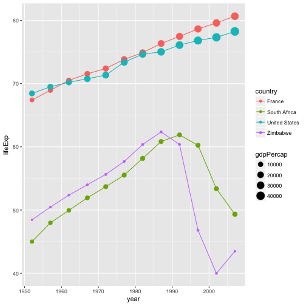
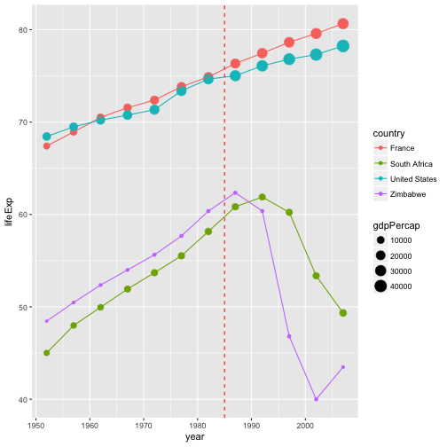
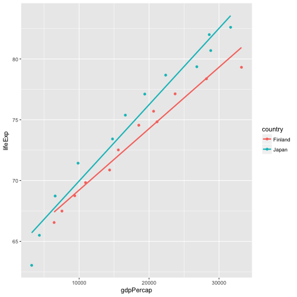

---
# Please do not edit this file directly; it is auto generated.
# Instead, please edit 04-functions-for-figures.md in _episodes_rmd/
title: "Functions for figures"
teaching: 30
exercises: 10
questions:
- "How can I use functions to generate figures"
- "How can I ensure my functions work properly"
objectives:
- "Learn to make figures using functions"
- "Learn to employ unit testing"
keypoints:
- "Functions help make figures easier to make"
- "Unittesting helps ensure functions do what we think they should"
output:  
      html_document
---


## Writing functions to generate figures
Now that we have functions to generate the datasets we need for our paper, we can start using them to generate the figures.

To illustrate this concept, we are going to generate a figure before converting it into a function.


```r
library("tidyverse")
```

```
## ── Attaching packages ────────────────────────────────── tidyverse 1.2.1 ──
```

```
## ✔ ggplot2 2.2.1     ✔ readr   1.1.1
## ✔ tibble  1.4.2     ✔ purrr   0.2.5
## ✔ tidyr   0.8.1     ✔ forcats 0.3.0
```

```
## ── Conflicts ───────────────────────────────────── tidyverse_conflicts() ──
## ✖ dplyr::filter() masks stats::filter()
## ✖ dplyr::lag()    masks stats::lag()
```

```r
gdp <- read.csv(file = "../data-output/gdp.csv")

gdp %>%
    filter(country %in% c("United States", "France", "Zimbabwe", "South Africa")) %>%
    ggplot(aes(x = year, y = lifeExp, color = country)) +
    geom_point(aes(size = gdpPercap)) +
    geom_line() 
```



```r
# + geom_vline(xintercept = year_break, color = "red", linetype = 2) # There is no "year_break" object
```


If we want to make a PDF file of this figure we could do:


```r
# pdf(file = "gdp_comparison.pdf", width = 8, height = 6, bg = "white") # `bg = white` is important for using a `.pdf` object in a slide.

gdp %>%
    filter(country %in% c("United States", "France", "Zimbabwe", "South Africa")) %>%
    ggplot(aes(x = year, y = lifeExp, color = country)) +
    geom_point(aes(size = gdpPercap)) +
    geom_line() +
    geom_vline(xintercept = 1985, color = "red", linetype = 2)
```



```r
# dev.off()
```

It's not very neat, we are hardcoding where the year break (the vertical dotted red line) should occur. This example is relatively simple but if you are building a more complex figure that relies on several variables, it means that they will be globally available in your knitr document, potentially causing conflicts down the road.

Let's convert this into a function:


```r
fig_gdp_comparison <- function() {

    gdp %>%
      filter(country %in% c("United States", "France", "Zimbabwe", "South Africa")) %>%
      ggplot(aes(x = year, y = lifeExp, color = country)) +
      geom_point(aes(size = gdpPercap)) +
      geom_line() +
      geom_vline(xintercept = 1985, color = "red", linetype = 2)

}
```

so this part gets a little prettier:


```r
pdf(file = "../fig/fig_gdp_comparison.pdf", width = 8, height = 6, bg = "white")
fig_gdp_comparison()
dev.off()
```

```
## png 
##   2
```

If you start making a lot of figures, it would be nice to have to repeat this first and third lines...

Let's create another function that will automate this process:

```r
## An example of a function that generates a PDF file from a function
## that creates a plot
## See http://nicercode.github.io/blog/2013-07-09-figure-functions/
make_pdf <- function(expr, filename, ..., verbose = TRUE) {
    if (verbose) {
        message("Creating: ", filename)
    }
    pdf(file = filename, ...)
    on.exit(dev.off())
    eval.parent(substitute(expr))
}
make_pdf(fig_gdp_comparison(), "fig_gdp_comparison.pdf", width = 8, height = 6, bg = "white")
```

```
## Creating: fig_gdp_comparison.pdf
```


We can even improve our `fig_gdp_commparison` to make it a little more general. For instance, we can add arguments such that the vertical line isn't always at 1985 but can be specified by the user. We can use the same approach for the list of countries to be included in the plot:


```r
fig_gdp_comparison <- function(year_break = 1985,
                               countries = c("United States", "France", "Zimbabwe", "South Africa")) {

    gdp %>%
      filter(country %in% countries) %>%
      ggplot(aes(x = year, y = lifeExp, color = country)) +
      geom_point(aes(size = gdpPercap)) +
      geom_line() +
      geom_vline(xintercept = year_break, color = "red", linetype = 2)
}
```

> ## Your turn
>
> Create your own function that generates a plot and use it with make_pdf.
> - If you are looking for some inspiration (or not too familiar with R syntax), the code below compares the relationship between GDP and life expectancy for Japan and Finland.
>
> > ## Solution
> >
> >```r
> > finland <- read.csv(file = "../example-manuscript/data-raw/Finland-gdp-percapita.csv")
> > japan <- read.csv(file = "../example-manuscript/data-raw/Japan-gdp-percapita.csv")
> > comp_finland_japan <- rbind(finland, japan)
> >
> > ggplot(comp_finland_japan, aes(x = gdpPercap, y = lifeExp, color = country)) +
> >   geom_point() +
> >   stat_smooth(method = "lm", se = FALSE)
> >```
> >
> >
> >
> > {: .output}
> {: .solution}
{: .challenge}


## Testing
### Using `testthat` to test your functions
One of the advantages of divvying up your entire manuscript into functions, is that you can test that they perform properly.

To do so, we are going to use the package `testthat` that has been designed to test functions written for packages, but it can be applied to any kind of functions.

Make sure you have `testthat` installed:

```r
install.packages("testthat")
```

Let's start by writing a first test:


```r
library("testthat")
## Example of using testthat to check that a function generating a dataset works as expected.
test_that("my first test: correct number of countries",
          expect_equal(length(unique(gather_gdp_data()$country)),
                       length(list.files(path = "../example-manuscript/data-raw/", pattern = "gdp-percapita\\.csv$")))
          )
```


The tests should be wrapped within the `test_that` function, you then provide a short sentence that explains the nature of the test. Keep it short and meaningful because it will be shown to you if the test fails, and having a clear message will help you figure out the problem.

I have also found that spending a little bit of time thinking about the message helps me refine the nature of the test and be more careful about what I test.

You can use one of the several functions that `testthat` provides that tells you what you should expect from your function. The most commonly used ones are `expect_equal()` and `expect_true()`. The functions `expect_warning()` and `expect_error()` are useful to make sure that your functions produce warnings and errors correctly.

### Your turn

Write a test for the `get_mean_lifeExp()` data, or write additional tests for the `gather_gdp_data()`.

## Putting it all together and getting organized
> ## Instructor notebooks
> The goal of this last part is to put together all the pieces started in the previous lesson to build a manuscript that is fully automated. Most of the files are already provided but they are missing the key pieces that make everything work. In this lesson, participants need to copy and paste the chunks of code listed in the appropriate files. At the end, their directory should look like the content of https://github.com/fmichonneau/teaching-automation

Will replace this with `ProjectTemplate`
```
|
`-- data-raw/
|   |
|   `-- Afghanistan-gdp-percapita.csv
|   `-- Albania-gdp-percapita.csv
|   `-- ....
|
`-- data-output/
|
`-- fig/
|
`-- R/
|   |
|    `-- figures.R
|    `-- data.R
|    `-- utils.R
|    `-- dependencies.R
|
`-- tests/
|
`-- manuscript.Rmd
`-- make.R
```

## Tests
`testthat` has a convenient function called `test_dir` that will run tests included in files in a given directory. We can use it to run all the tests in our `tests/` folder.


```r
test_dir("tests/")
```

Let's turn it into a function, so we'll be able to add some additional functionalities to it a little later. We are also going to save it at the root of our working directory in the file called `make.R`:


```r
## add this to make.R
make_tests <- function() {
    test_dir("tests/")
}
```

## Figures
This is the code to generate the two figures in the manuscript:


```r
## add this to R/figure.R
plot_summary_lifeExp_by_continent <- function(mean_lifeExp) {
    ggplot(mean_lifeExp, aes(x = year, y = mean_lifeExp, colour = continent)) +
      geom_line() + facet_wrap(~ continent) + theme(legend.position = "top")
}

plot_change_trend <- function(mean_lifeExp, year_break) {
    tmp_data <- get_coef_before_after(mean_lifeExp, year_break)
    ggplot(tmp_data, aes(x = period, y = trend, colour = continent, group = continent)) +
      geom_point() + geom_path()
}
```

This is the code to generate PDF files from figures, and the two figures as PDF files


```r
## add this to make.R
make_figures <- function(path = "fig", ...) {
    make_summary_by_continent(path = path, ...)
    make_change_trend(path = path, ...)
}

make_summary_by_continent <- function(path = "fig", ...) {
    mean_lifeExp <- get_mean_lifeExp(gather_gdp_data())
    p <- plot_summary_lifeExp_by_continent(mean_lifeExp)
    make_pdf(print(p), file = file.path(path, "summary_by_continent.pdf"), ...)
}

make_change_trend <- function(path = "fig", year = 1980, ...) {
    mean_lifeExp <- get_mean_lifeExp(gather_gdp_data())
    p <- plot_change_trend(mean_lifeExp, year = year)
    make_pdf(print(p), file = file.path(path, "change_trend.pdf"), ...)
}
```

## Data

This is the code that generates the intermediate datasets:


```r
## add this to R/data.R
gather_gdp_data <- function(path = "data-raw") {
    split_gdp_files <- list.files(path = path, pattern = "gdp-percapita\\.csv$", full.names = TRUE)

    split_gdp_list <- lapply(split_gdp_files, read.csv)
    gdp <- do.call("rbind", split_gdp_list)
    gdp
}

get_mean_lifeExp <- function(gdp) {
    mean_lifeExp_by_cont <- gdp %>% group_by(continent, year) %>%
      summarize(mean_lifeExp = mean(lifeExp)) %>% as.data.frame
    mean_lifeExp_by_cont
}

get_latest_lifeExp <- function(gdp) {
    latest_lifeExp <- gdp %>% filter(year == max(gdp$year)) %>%
      group_by(continent) %>%
      summarize(latest_lifeExp = mean(lifeExp)) %>%
      as.data.frame
    latest_lifeExp
}

get_coef_before_after <- function(mean_lifeExp, year_break) {
    coef_before_after <- lapply(unique(mean_lifeExp$continent), function(cont) {
                                    mdl_before <- lm(mean_lifeExp ~ year,
                                                     data = mean_lifeExp,
                                                     subset = (continent == cont & year <= year_break))
                                    mdl_after  <- lm(mean_lifeExp ~ year,
                                                     data = mean_lifeExp,
                                                     subset = (continent == cont & year > year_break))
                                    rbind(c(as.character(cont), "before", coef(mdl_before)[2]),
                                          c(as.character(cont), "after", coef(mdl_after)[2]))
                                }) %>%
      do.call("rbind", .) %>% as.data.frame %>%
      setNames(c("continent", "period", "trend"))
    coef_before_after$trend <- as.numeric(levels(coef_before_after$trend)[coef_before_after$trend])
    coef_before_after$period <- factor(coef_before_after$period, levels = c("before", "after"))
    coef_before_after
}
```

This is the code to generate the CSV files that contain the intermediate datasets that are needed to draw the figures. The function make_data generates both datasets at once.


```r
## add this to make.R
make_data <- function(path = "data-output", verbose = TRUE) {
    make_gdp_data(path)
    make_mean_lifeExp_data()
}

make_gdp_data <- function(path = "data-output") {
    gdp <- gather_gdp_data()
    make_csv(gdp, file = file.path(path, "gdp.csv"))
}

make_mean_lifeExp_data <- function(path = "data-output") {
    gdp <- gather_gdp_data()
    make_csv(get_mean_lifeExp(gdp), file = file.path(path, "mean_lifeExp.csv"))
}
```

## Cleaning

The only way to ensure that your analysis is reproducible is to delete all the intermediate and final products to make sure your functions can recreate everything from the raw data and your code.

Having the figures and the intermediate data files isolated in their own folders in your working directory will allow you to make sure you only delete these generated figures, and none of the original data.


```r
## add this to make.R
clean_data <- function(path = "data-output") {
    to_rm <- list.files(path = path, pattern = "csv$", full.names = TRUE)
    res <- file.remove(to_rm)
    invisible(res)
}

clean_figures <- function(path = "fig") {
    to_rm <- list.files(path = path, pattern = "pdf$", full.names = TRUE)
    res <- file.remove(to_rm)
    invisible(res)
}
```

## Make everything

These are wrapper functions to generate/delete everything:


```r
## add this to make.R
make_ms <- function() {
    rmarkdown::render("manuscript.Rmd", "html_document")
    invisible(file.exists("manuscript.html"))
}

clean_ms <- function() {
    res <- file.remove("manuscript.html")
    invisible(res)
}

make_all <- function() {
    make_data()
    make_figures()
    make_tests()
    make_ms()
}

clean_all <- function() {
    clean_data()
    clean_figures()
    clean_ms()
}
```

and before we continue, we are going to replace the make_tests function with something a little more comprehensive:


```r
## add this to make.R
make_tests <- function() {
    if (require(testthat)) {
        p <- test_dir("tests/")
        if (!interactive() && any(p$failed)) {
            q("no", status = 1, FALSE)
        }
    } else {
        message("skipped the tests, testthat not available.")
        return(NULL)
    }
}
```
